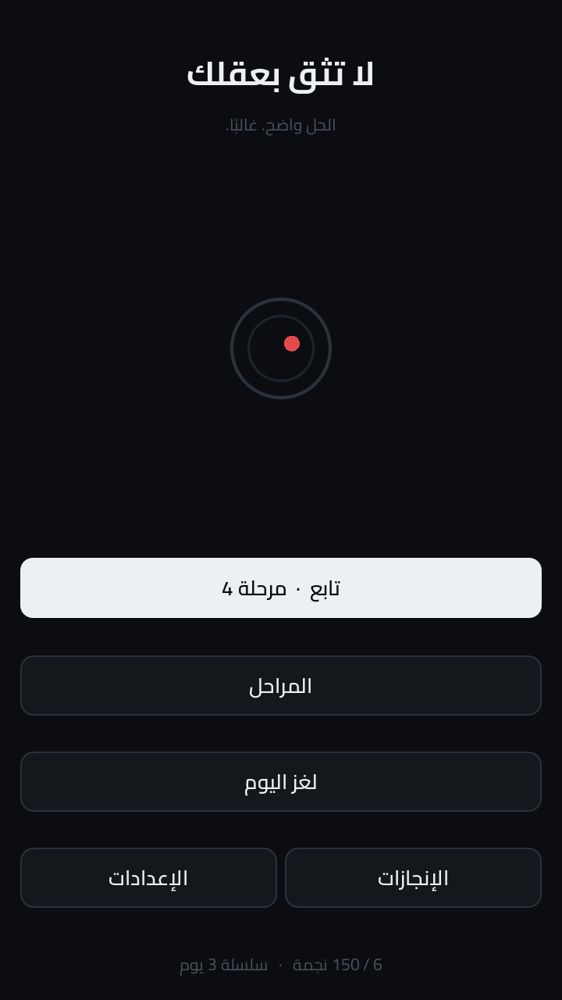
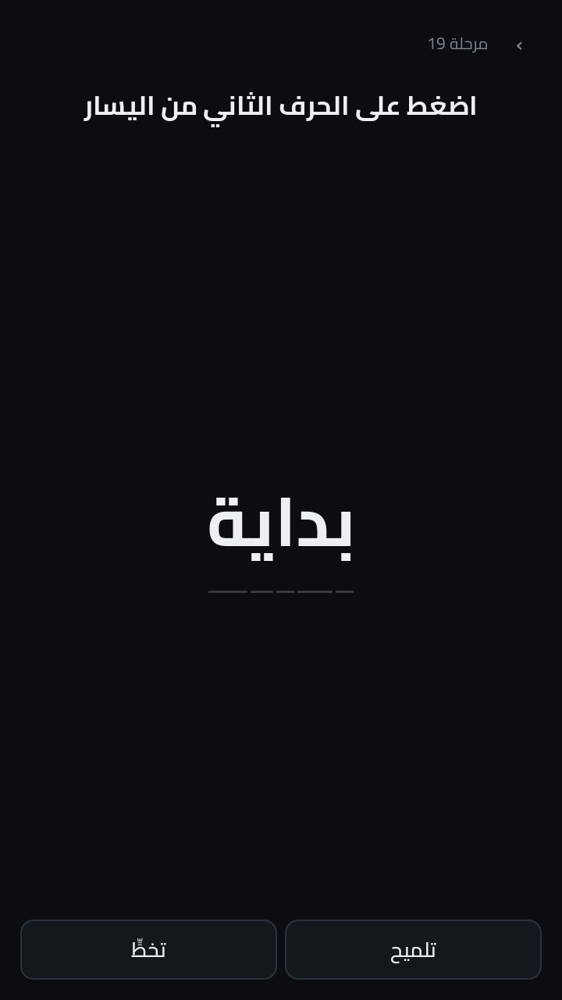
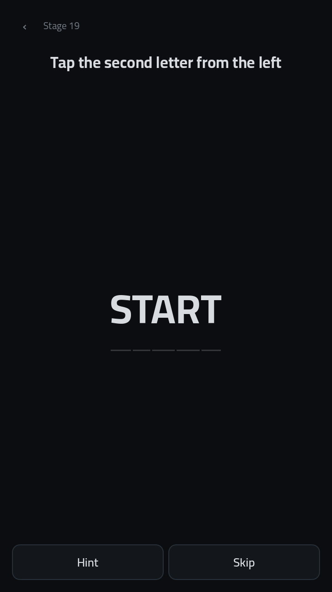

# DON'T TRUST YOUR MIND · لا تثق بعقلك

A short-form deception puzzle game for Android. One puzzle per stage, five to
sixty seconds each. The answer is always logical — and almost never the first
thing you think of.

Arabic and English, both first-class. Fully offline.



## The idea

Difficulty here never comes from having more pieces on screen. It comes from
your own first reading being wrong.

Stage 1 says **"tap the red one"** and shows a blue circle, a green square, a
yellow triangle — and the word *الأحمر* printed in red. Nothing on screen is a
red *shape*. The word is the only red thing there is.

Stage 22 says **"tap the red one"** again. This time a shape really is red, and
the word is grey. Players who memorised "the word is the answer" get it wrong.
The rule never changed; only the board did.

That is the whole game: learn the rule, not the pattern.

## Language is part of the puzzle

Puzzles are authored **per language**, not translated. Stage 19 asks for "the
second letter from the left" and gives a different answer in each:

| | word | second from the left |
|---|---|---|
| Arabic | بداية | **ي** — logical index 3, because Arabic starts on the right |
| English | START | **T** — logical index 1 |

<p align="center">
  
  
</p>

Arabic is cursive, so per-letter tapping cannot be done by splitting a word into
separate labels. The whole string is shaped once through HarfBuzz and character
targets are recovered from the shaped result, which keeps the joins intact and
makes "the first letter" land on the right-hand glyph in Arabic and the
left-hand one in English, automatically.

Stage 20 pushes it further: *"How many words are in this sentence?"* — the
answer is 5 in Arabic and 7 in English.

## Contents

- **150 stages** across ten chapters, each chapter introducing a different kind
  of deception: what you see, what you read, what you remember, what you touch,
  what you believe, what you assume, what repeats, what you rush, what the
  screen hides, what you trust.
- **10 daily puzzles**, selected deterministically from the date, so every
  device agrees without a server.
- Stars, streaks, best times, eight achievements, shareable results that never
  leak the answer.

## Running it

Needs Godot **4.3** or newer.

```bash
godot --path dont-trust-your-mind            # play
./run_tests.sh                               # verify (GODOT=... to pick a binary)
```

### Android

`export_presets.cfg` is committed: arm64-v8a + armeabi-v7a, target SDK 34,
immersive, portrait-locked, `VIBRATE` only — **no INTERNET permission**,
because nothing in the game needs one. minSdkVersion is 21 (Godot's
precompiled template; see [docs/ANDROID_BUILD.md](docs/ANDROID_BUILD.md)).

```bash
godot --headless --export-debug   "Android" build/dtym-debug.apk
godot --headless --export-release "Android" build/dtym-release.apk   # needs a
                                             # release keystore — see below
```

Both builds have been produced and verified in this environment: signed
(v1/v2/v3), zipaligned, correct manifest and permissions, all puzzle content
and fonts present, `tests/`/`docs/` correctly excluded. Full verification
output, the exact toolchain used (Ubuntu's `android-sdk-build-tools` package,
since `dl.google.com` is not reachable here), a real bug found and fixed in
the export preset, and what still needs a physical device are all in
[docs/ANDROID_BUILD.md](docs/ANDROID_BUILD.md). No emulator or device install
pass was possible in this container (no `/dev/kvm`, no hardware
virtualization).

## Architecture

```
Content (JSON)  →  Model (typed)  →  Session (pure logic)  →  Board (rendering)
```

No puzzle is hardcoded anywhere. A puzzle is a list of elements plus a solution
rule, and every trick in the game is a composition of six element kinds
(`label`, `chars`, `shape`, `button`, `zone`, `spacer`) and four rule kinds
(`tap`, `sequence`, `no_tap`, `hold`). Adding a puzzle is a data edit; the
renderer never changes.

Solution targets can address an element, a character inside one
(`char:word:3`), the empty board, or the game's own interface (`ui:hint`,
`ui:stage`, `ui:skip`, `ui:timer`, `ui:back`) — which is how the UI itself
becomes an answer in chapter 4. Chrome only becomes a target when a puzzle
explicitly arms it, so you can never lose a stage by reaching for the Hint
button on a puzzle that did not claim it.

`PuzzleSession` owns every rule and no nodes, so the whole rule system is
exercised headlessly.

```
src/
├── core/       save · localization · audio · puzzle library · flow
├── puzzles/    model · runtime (session + board) · widgets
├── ui/         screens · components · theme
└── audio/      sound effects synthesised at boot — no audio assets shipped
```

Full write-up in [docs/DESIGN.md](docs/DESIGN.md).

## Verification

4417 automated checks, 0 failures, plus a 21-assertion end-to-end smoke test.

Every puzzle is **played to completion by the test suite** in both languages,
using only its own declared solution, asserting that a clean run costs no wrong
taps and that the answer is on screen at the moment it must be tapped. Content
tests shape the real text with the real font and verify that every character
index lands on the character the author intended — a check that caught three
genuine off-by-one bugs in this content set before anyone played it.

See [docs/TEST_PLAN.md](docs/TEST_PLAN.md).

## Credits

Typeface: [Cairo](https://github.com/Gue3bara/Cairo), SIL Open Font License 1.1
(`assets/fonts/OFL.txt`). Covers Arabic, Latin, and both digit sets in one
family, so mixed text never falls back.
